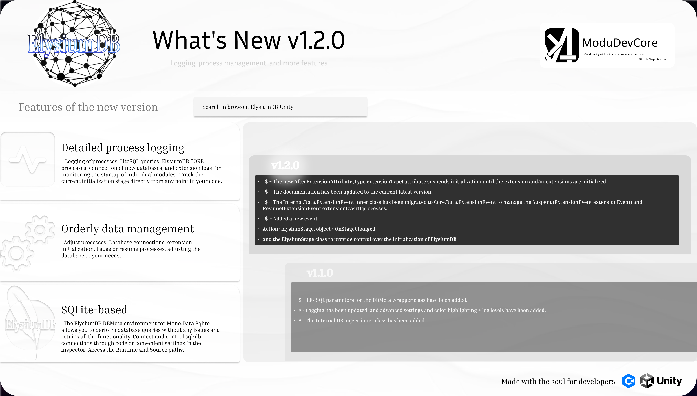

<p align="center">
  
</p>

# ElysiumDB Unity Library

[](https://github.com/ModuDevCore/ElysiumDB-Unity/releases)
[](https://unity.com/)
[](LICENSE)
[](https://openupm.com/packages/com.modudevcore.elysiumdb/)

**ElysiumDB** is a modular Unity library for managing databases and an extensible data storage architecture.

It provides a unified centralized API for working with databases, extensions, and connections, making it easier to build scalable data storage systems in Unity projects. Start developing, see [TUTORIAL.md](TUTORIAL.md) 

<p align="center">
  <a href="TUTORIAL.md"></a>

  <a href="REFERENCE.md"></a>
</p>
<p align="center">
  <a href="changelog.md"></a>
</p>

## 📌 Useful Links

| Link                                                               | Description                                          |
| ------------------------------------------------------------------ | ---------------------------------------------------- |
| **[Tutorial](./TUTORIAL.md)**                                      | Step-by-step guide with examples and usage scenarios |
| **[API Reference](./REFERENCE.md)**                                | Full public API documentation                        |
| **[Technical Documentation](./TECHNICAL.md)**                      | Architecture, internal systems, and extensions       |
| [Releases](https://github.com/ModuDevCore/ElysiumDB-Unity/releases) | Download the latest version                          |
| [OpenUPM](https://openupm.com/packages/com.modudevcore.elysiumdb/) | Install via Unity Package Manager                    |
| [Issues](https://github.com/ModuDevCore/ElysiumDB-Unity/issues)          | Report bugs or issues                                |
| [Pull Requests](https://github.com/ModuDevCore/ElysiumDB-Unity/pulls)    | Contribute to the project                            |

### 📂 Database Examples

- [Managing Multiple Databases](./Examples/Database/DBConnections.md)
- [Executing SQL Commands](./Examples/Database/Execute.md)
- [Query Examples](./Examples/Database/QueryExamples.md)
- [Process management](./Examples/Database/ProcessManagement.md)
- [CreateElysiumDatabase](./Examples/CreateElysiumDatabase.md)

### 🧩 Extension Examples

- [Creating and Using Extensions](./Examples/Extensions/CreateAndUseExtensions.md)
- [RequireExtensionAttribute](./Examples/Extensions/RequireExtensionAttribute.md)
- [ExtensionProcessOrderAttribute](./Examples/Extensions/ExtensionProcessOrderAttribute.md)
- [DefaultExtensionGroupAttribute](./Examples/Extensions/DefaultExtensionGroupAttribute.md)
- [AfterExtensionAttribute](./Examples/Extensions/AfterExtensionAttribute.md)

---

## ✨ Features

* Central database manager (`ElysiumDatabase`)
* Extension system with automatic dependency registration
* Connection lifecycle management (`Connect / Detach / Dispose`)
* Unified access to multiple databases simultaneously
* Flexible architecture via `DBExtensionBase`
* Dependency system via `RequireExtensionAttribute`
* Low coupling design
* Runtime and Unity Editor support
* Ability to build modular data-driven systems

---

## 🚀 Quick Start

### 1. Installation

**Option A — OpenUPM (recommended)**

```bash
openupm add com.modudevcore.elysiumdb
```

**Option B — Git URL (UPM)**
In Unity:
`Window → Package Manager → + → Add package from git URL`

```text
https://github.com/ModuDevCore/ElysiumDB.git
```

**Option C — .unitypackage**
Download the latest release and import the `.unitypackage` into Unity.

**Check out the tutorial**
Detailed usage description, recommended for viewing.
**[Tutorial](./TUTORIAL.md)**

---

### 2. Minimal Example

```csharp
using ModuDevCore.ElysiumDB;
using UnityEngine;
using System.Collections.Generic;

public class Player
{
    public string Name;
    public int Money;
    public int Score;
}

public class ExampleUsage : MonoBehaviour
{
    private void Start()
    {
        var elysiumDB = new ElysiumDatabase();
        elysiumDB.New();

        List<Player> players = elysiumDB["main"].QueryList<Player>(
            "SELECT Name, Money, Score FROM Player"
        );

        foreach (Player player in players)
        {
            Debug.Log($"{player.Name} | Money: {player.Money} | Score: {player.Score}");
        }
    }
}
```

---

## 🧠 Architectural Advantages

ElysiumDB is built around the following principles:

* **Modularity First** — every part of the system is an extension
* **Loose Coupling** — the core does not depend on concrete implementations
* **Scalability** — suitable for large projects with multiple databases
* **Extensibility** — ability to add new DB extensions without modifying the core
* **Unity Native Design** — respects Unity Editor/Runtime separation

---

## 🧩 Core Systems

### 🔹 ElysiumDatabase

Central manager:

* connection management
* extension registration
* database lifecycle control

### 🔹 DBMeta

Connection wrapper:

* SQL command execution
* connection handling
* query execution logic

### 🔹 DBExtensionBase

Base extension class:

* module integration
* unified lifecycle
* global API access

### 🔹 RequireExtensionAttribute

Dependency system:

* automatic extension linking
* declaration of module dependencies

---

## 📚 Documentation

| Document       | Description              | Link                           |
| -------------- | ------------------------ | ------------------------------ |
| Tutorial       | Practical usage guide    | [TUTORIAL.md](./TUTORIAL.md)   |
| API Reference  | Public API documentation | [REFERENCE.md](./REFERENCE.md) |
| Technical Docs | Internal architecture    | [TECHNICAL.md](./TECHNICAL.md) |

---

## 🛠 Main Use Cases

* Managing local SQLite/DB files
* Extension systems for game logic
* Data-driven architectures in Unity
* Player saves and profiles
* Backend-agnostic data layer

---

## 🤝 Contributing

The project is under active development.

Before submitting a PR:

* check existing issues
* discuss architectural changes
* consider potential breaking changes (alpha API)

---

## 📄 License

The project is distributed under the **MIT** license.
