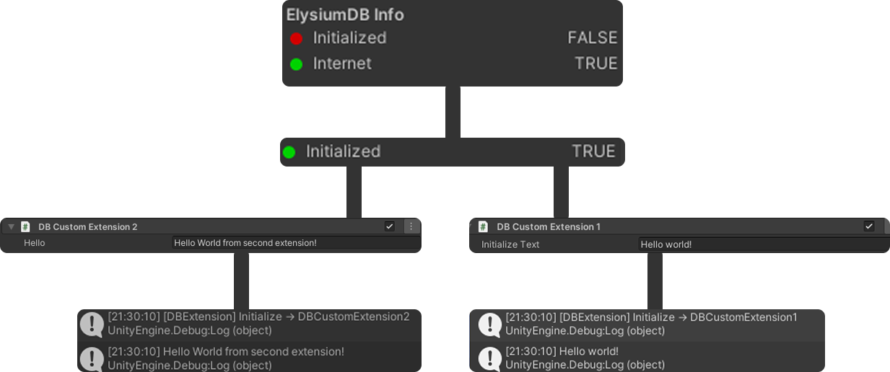
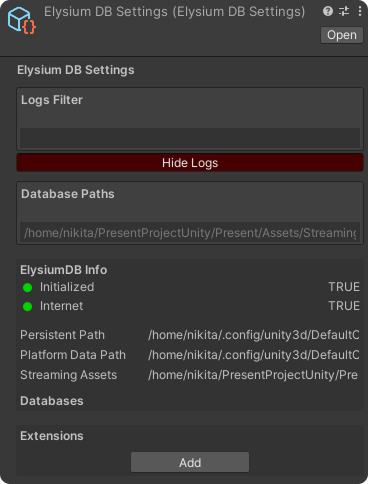
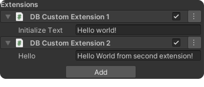

<p align="center">
  
</p>

Practical step-by-step guide for working with the library.
This section contains the most important usage scenarios with code examples and illustrations.

---
## Table of Contents
Tutorial<br>
│<br>
├── 1. [Installation](#installation)<br>
├── 2. [Creating a Database](#creating-a-database)<br>
├── 3. [Creating Tables](#creating-tables)<br>
├── 4. CRUD Operations<br>
│   ├── [Insert](#crud-insert)<br>
│   ├── [Query](#crud-query)<br>
│   ├── [Update](#crud-update)<br>
│   └── [Delete](#crud-delete)<br>
├── 5. [Creating Your First Extension](#create-your-first-extension)<br>
├── 6. [Where to Go Next](#where-to-go-next)<br>

---

<a id="installation"></a>
## Installation

**Option A — OpenUPM (recommended)**

```bash
openupm add com.modudevcore.elysiumdb
```

**Option B — Git URL (UPM)**
In Unity:
`Window → Package Manager → + → Add package from git URL`

```text
https://github.com/ModuDevCore/ElysiumDB.git
```

**Option C — .unitypackage**
Download the latest release and import the `.unitypackage` into Unity.

---

<a id="creating-a-database"></a>
## Creating a Database
```csharp
using ModuDevCore.ElysiumDB;
using UnityEngine;

public class ExampleCreateDatabase : MonoBehaviour
{
    private void Start()
    {
        var elysiumDB = new ElysiumDatabase();
        elysiumDB.New(); // Initialization of databases and extensions, now you can get an instance through ElysiumDatabase.Instance.
    }
}
```

**Description:**  
Initializes ElysiumDB, loads configured extensions, and makes the global database manager available through ElysiumDatabase.Instance.



> **See also**
>
> - [CreateElysiumDatabase](./Examples/CreateElysiumDatabase.md)

---

<a id="creating-tables"></a>
## Create Tables ( Runtime )
This section demonstrates how to create tables after ElysiumDB has been initialized, while the application is already running.

```csharp
using ModuDevCore.ElysiumDB;
using UnityEngine;

public class ExampleCreateTable : MonoBehaviour
{
    // After ExampleCreateDatabase
    private void Start()
    {
        ElysiumDatabase elysiumDB = ElysiumDatabase.Instance;

        // Create a database connection
        elysiumDB.CreateSQLiteDatabase("Players.db");

        string createTableQuery = @"
            CREATE TABLE IF NOT EXISTS Player
            (
                Id INTEGER PRIMARY KEY AUTOINCREMENT,
                Name TEXT NOT NULL,
                Money INTEGER NOT NULL DEFAULT 0,
                Score INTEGER NOT NULL DEFAULT 0
            );";

        elysiumDB["Players.db"].Execute(createTableQuery);
    }
}
```

> **See also**
>
> - [DBConnections](./Examples/Database/DBConnections.md)
> - [CreateSQLiteDatabase](./Examples/DBMeta/CreateSQLiteDatabase.md)
> - [Query Examples](./Examples/Database/QueryExamples.md)
> - [Execute](./Examples/DBMeta/Execute.md)

## CRUD Operations
<a id="crud-insert"></a>
### Insert
```csharp
using ModuDevCore.ElysiumDB;
using UnityEngine;

public class ExampleInsert : MonoBehaviour
{
    // After ExampleCreateDatabase
    private void Start()
    {
        ElysiumDatabase.Instance["Players.db"].Execute(
            "INSERT INTO Player(Name, Level) VALUES(@name, @level)",
            ("name", "Alex"),
            parameters: new (string name, object value)[]
            {
                ("@level", 1)
            }
        );
    }
}
```
<a id="crud-query"></a>
### Query
```csharp
using ModuDevCore.ElysiumDB;
using UnityEngine;

public class ExampleQuery : MonoBehaviour
{
    // After ExampleCreateDatabase
    private void Start()
    {
        List<string> playerNames = ElysiumDatabase.Instance["Players.db"].QueryColumn<string>(
            "SELECT Name FROM Player"
        );

        foreach (string name in playerNames)
        {
            Debug.Log(name);
        }
    }
}
```
<a id="crud-update"></a>
### Update
```csharp
using ModuDevCore.ElysiumDB;
using UnityEngine;

public class ExampleUpdate : MonoBehaviour
{
    // After ExampleCreateDatabase
    private void Start()
    {
        ElysiumDatabase.Instance["Players.db"].Execute(
            @"UPDATE Player
              SET Money = @money,
                  Score = @score
              WHERE Id = @id",
            parameters: new (string name, object value)[]
            {
                ("@money", 9999),
                ("@score", 9999),
                ("@id", 1)
            });
    }
}
```
<a id="crud-delete"></a>
### Delete

```csharp
using ModuDevCore.ElysiumDB;
using UnityEngine;

public class ExampleDelete : MonoBehaviour
{
    // After ExampleCreateDatabase
    private void Start()
    {
        ElysiumDatabase.Instance["Players.db"].Execute(
            "DELETE FROM Player WHERE Id = @id",
            parameters: new (string name, object value)[]
            {
                ("@id", 1)
            });
    }
}
```

> **See also**
>
> - [DBConnections](./Examples/Database/DBConnections.md)
> - [CreateSQLiteDatabase](./Examples/Database/CreateSQLiteDatabase.md)
> - [Query Examples](./Examples/Database/QueryExamples.md)
> - [Execute](./Examples/DBMeta/Execute.md)

<a id="create-your-first-extension"></a>
## Creating Your First Extension

Create two files anywhere in your project folder:

### DBCustomExtension1.cs
```csharp
using UnityEngine;
using ModuDevCore.ElysiumDB;
using ModuDevCore.ElysiumDB.Extension;

public class DBCustomExtension1 : DBExtensionBase
{
    public string initializeText = "Hello world!";

    protected override void OnInitialize(ElysiumDatabase elysium)
    {
        Log(initializeText);
    }

    protected override void OnDispose() { }

    public void PrintHelloFromSecondExtension()
    {
        GetExtension<DBCustomExtension2>().Hello();
    }
}
```

### DBCustomExtension2.cs
```csharp
using UnityEngine;
using ModuDevCore.ElysiumDB;
using ModuDevCore.ElysiumDB.Extension;

public class DBCustomExtension2 : DBExtensionBase
{
    public string hello = "Hello World from second extension!";

    protected override void OnInitialize(ElysiumDatabase elysium)
    {
        
    }

    protected override void OnDispose()
    {
    }

    public void Hello()
    {
        Log(hello);
    }
}
```

Then open **ElysiumDB → Settings**.



Click the **Add** button to add a new Extension and select **DBCustomExtension1** and **DBCustomExtension2** from the list.

At the end, you should see two modules in the Extensions list.



> **See also**
>
> - [Create And Use Extensions](./Examples/Extensions/CreateAndUseExtensions.md)
> - [ProcessManagement](./Examples/Database/ProcessManagement.md)
> - [AfterExtensionAttribute](./Examples/Extensions/AfterExtensionAttribute.md)
> - [ExtensionProcessOrderAttribute](./Examples/Extensions/ExtensionProcessOrderAttribute.md)
> - [RequireExtensionAttribute](./Examples/Extensions/RequireExtensionAttribute.md)
> - [DefaultExtensionGroupAttribute](./Examples/Extensions/DefaultExtensionGroupAttribute.md)


<a id="where-to-go-next"></a>

## Where to Go Next

Congratulations! You now know the basics of working with ElysiumDB.

Continue exploring the library through practical examples or dive into the complete API reference.

### 📂 Database Examples

- [Managing Multiple Databases](./Examples/Database/DBConnections.md)
- [Executing SQL Commands](./Examples/Database/Execute.md)
- [Query Examples](./Examples/Database/QueryExamples.md)
- [Process management](./Examples/Database/ProcessManagement.md)
- [CreateElysiumDatabase](./Examples/CreateElysiumDatabase.md)

### 🧩 Extension Examples

- [Creating and Using Extensions](./Examples/Extensions/CreateAndUseExtensions.md)
- [RequireExtensionAttribute](./Examples/Extensions/RequireExtensionAttribute.md)
- [ExtensionProcessOrderAttribute](./Examples/Extensions/ExtensionProcessOrderAttribute.md)
- [DefaultExtensionGroupAttribute](./Examples/Extensions/DefaultExtensionGroupAttribute.md)
- [AfterExtensionAttribute](./Examples/Extensions/AfterExtensionAttribute.md)

### 📖 Documentation

- [API Reference](./REFERENCE.md)

---

## Best Practices
- Create custom modules only in rare cases. If you need to extend functionality, use class inheritance.
- Group modules by categories to avoid confusion.
- Feel free to add multiple modules of the same class, but give them distinct fields so they can be differentiated.