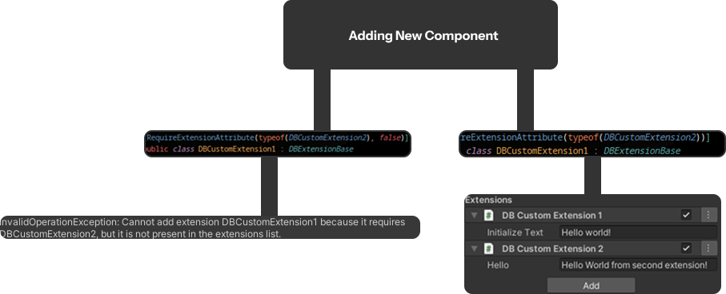
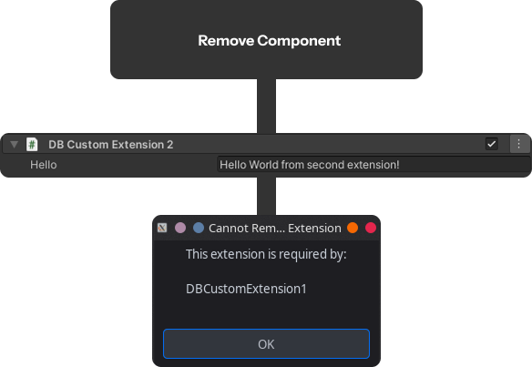
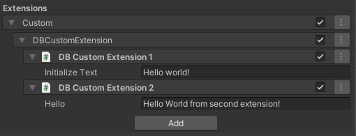

<p align="center">
  
</p>

Practical step-by-step guide for working with the library.
This section contains the most important usage scenarios with code examples and illustrations.

---
## See Also
- [Full Reference Documentation](./REFERENCE.md) — detailed description of all classes and methods
- [Technical Documentation](./TECHNICAL.md) — internal architecture and extensibility
- [README](./README.md) — general project information

---
## Table of Contents
- [1. Installation](#1-installation)
- [2. Initial Setup](#2-initial-setup)
- [3. Basic Usage Scenarios](#3-basic-usage-scenarios)
- [4. Useful Examples](#4-useful-examples)
- [5. Best Practices](#5-best-practices)
- [See Also](#see-also)
---

<a id="1-installation"></a>
## 1. Installation

**Option A — OpenUPM (recommended)**

```bash
openupm add com.modudevcore.elysiumdb
```

**Option B — Git URL (UPM)**
In Unity:
`Window → Package Manager → + → Add package from git URL`

```text
https://github.com/ModuDevCore/ElysiumDB.git
```

**Option C — .unitypackage**
Download the latest release and import the `.unitypackage` into Unity.

---

<a id="2-initial-setup"></a>
## 2. Initial Setup
```csharp
using ModuDevCore.ElysiumDB;
using UnityEngine;

public class ExampleUsage : MonoBehaviour
{
    private ElysiumDatabase _db;

    private async void Awake()
    {
        _db = new ElysiumDatabase();
        _db.New(); // initialize system and connections
    }

    private async void Start()
    {
        var connection = _db.Connections["main"];

        var reader = connection.RunCmd("SELECT * FROM Players");

        while (reader.Read())
        {
            Debug.Log(reader[0]);
        }
    }
}
```

**Description:**  
Brief explanation of what happens during initialization...


---

<a id="3-basic-usage-scenarios"></a>
## 3. Basic Usage Scenarios

### 3.1 Creating a Custom Module/Extension for ElysiumDB

Create two files anywhere in your project folder:

### DBCustomExtension1.cs
```csharp
using UnityEngine;
using ModuDevCore.ElysiumDB;
using ModuDevCore.ElysiumDB.Extension;

public class DBCustomExtension1 : DBExtensionBase
{
    public string initializeText = "Hello world!";

    protected override void OnInitialize(ElysiumDatabase elysium)
    {
        Debug.Log(initializeText);
    }

    protected override void OnDispose() { }

    public void PrintHelloFromSecondExtension()
    {
        GetExtension<DBCustomExtension2>().Hello();
    }
}
```

### DBCustomExtension2.cs
```csharp
using UnityEngine;
using ModuDevCore.ElysiumDB;
using ModuDevCore.ElysiumDB.Extension;

public class DBCustomExtension2 : DBExtensionBase
{
    public string hello = "Hello World from second extension!";

    protected override void OnInitialize(ElysiumDatabase elysium)
    {
        
    }

    protected override void OnDispose()
    {
    }

    public void Hello()
    {
        Debug.Log(hello);
    }
}
```

Then open **ElysiumDB → Settings**.


Click the **Add** button to add a new Extension and select **DBCustomExtension1** and **DBCustomExtension2** from the list.

At the end, you should see two modules in the Extensions list.


---

### 3.2 [RequireExtensionAttribute](./REFERENCE.md#ModuDevCore.ElysiumDB.Attributes.RequireExtensionAttribute)

Create two files anywhere in your project folder:

### DBCustomExtension1.cs
```csharp
using UnityEngine;
using ModuDevCore.ElysiumDB;
using ModuDevCore.ElysiumDB.Extension;

[RequireExtensionAttribute(typeof(DBCustomExtension2))]
public class DBCustomExtension1 : DBExtensionBase
{
    public string initializeText = "Hello world!";

    protected override void OnInitialize(ElysiumDatabase elysium)
    {
        Debug.Log(initializeText);
    }

    protected override void OnDispose() { }

    public void PrintHelloFromSecondExtension()
    {
        GetExtension<DBCustomExtension2>().Hello();
    }
}
```

### DBCustomExtension2.cs
```csharp
using UnityEngine;
using ModuDevCore.ElysiumDB;
using ModuDevCore.ElysiumDB.Extension;

public class DBCustomExtension2 : DBExtensionBase
{
    public string hello = "Hello World from second extension!";

    protected override void OnInitialize(ElysiumDatabase elysium)
    {
        
    }

    protected override void OnDispose()
    {
    }

    public void Hello()
    {
        Debug.Log(hello);
    }
}
```

Then open **ElysiumDB → Settings**.

Click the **Add** button to add a new Extension and select **DBCustomExtension1** from the list.


At the end, you should see two modules in the Extensions list (or a warning if you used `[RequireExtensionAttribute(typeof(DBCustomExtension2), false)]`).






---

<a id="4-useful-examples"></a>
## 4. Useful Examples

### Example 1: Complete Working Case
```csharp
using UnityEngine;
using ModuDevCore.ElysiumDB;
using ModuDevCore.ElysiumDB.Extension;

[DefaultExtensionGroupAttribute("Custom/DBCustomExtension")]
[ExtensionProcessOrderAttribute(nameof(DBCustomExtension1), 0)]
[RequireExtensionAttribute(typeof(DBCustomExtension2))]
public class DBCustomExtension1 : DBExtensionBase
{
    public string initializeText = "Hello world!";

    protected override void OnInitialize(ElysiumDatabase elysium)
    {
        Debug.Log(initializeText);
    }

    protected override void OnDispose() { }

    public void PrintHelloFromSecondExtension()
    {
        GetExtension<DBCustomExtension2>().Hello();
    }
}

[ExtensionProcessOrderAttribute(nameof(DBCustomExtension1), 1)]
[DefaultExtensionGroupAttribute("Custom/DBCustomExtension")]
public class DBCustomExtension2 : DBExtensionBase
{
    public string hello = "Hello World from second extension!";

    protected override void OnInitialize(ElysiumDatabase elysium)
    {
        
    }

    protected override void OnDispose()
    {
    }

    public void Hello()
    {
        Debug.Log(hello);
    }
}
```

**Expected Result:**  


---

<a id="5-useful-examples"></a>
## 5. Best Practices
- Create custom modules only in rare cases. If you need to extend functionality, use class inheritance.
- Group modules by categories to avoid confusion.
- Feel free to add multiple modules of the same class, but give them distinct fields so they can be differentiated.